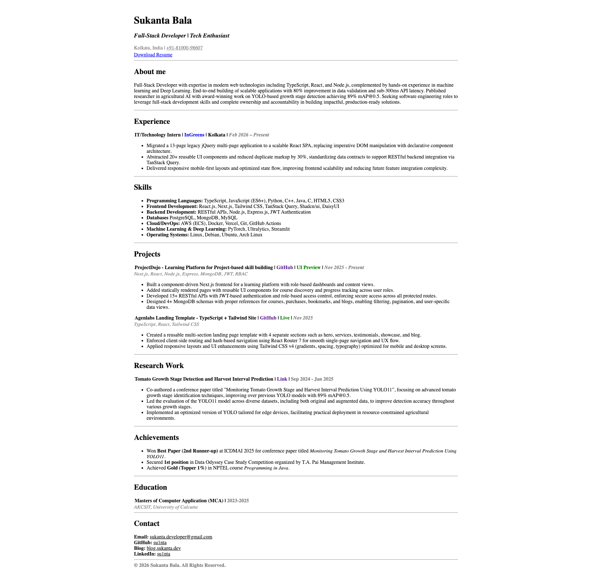

## Sukanta's Resume

A backend developer's portfolio/resume, a single-page website built with plain **HTML** and **CSS**. It’s lightweight, fast, and easy to customize.

[Live Link](https://sukanta.dev)



### What’s inside

- Single-page resume layout
- “Download Resume” link (Google Drive direct download)
- Projects, skills, education, and contact sections

### Run locally

You can open the file directly:

- Double-click `index.html`

Or run a tiny local server (recommended):

**VS Code (Live Server extension)**

1. Install “Live Server”
2. Right-click `index.html` → **Open with Live Server**

**Python**

```bash
python3 -m http.server 5500
```

Then open: `http://localhost:5500`

### Customize

Open `index.html` and update:

- **Name + Title** (top heading)
- **About me** paragraph
- **Projects** (titles, tech stack, links)
- **Contact** links (email, GitHub, blog, LinkedIn)

#### Update the resume download link

The “Download Resume” button currently points to a Google Drive direct-download URL:

```html
href="https://drive.google.com/uc?export=download&id=YOUR_FILE_ID"
```

To use your own PDF:

1. Upload the PDF to Google Drive
2. Set sharing to “Anyone with the link” (if you want public downloads)
3. Copy the file ID from the share link and replace `YOUR_FILE_ID`

### Deploy

Since this is static HTML, you can deploy it anywhere:

- **GitHub Pages**: push to a repo → Settings → Pages → deploy from `main` (root)
- **Vercel / Netlify**: import repo → deploy as static site

### Project structure

```
.
├── index.html
└── README.md
```

### License

Use it freely for your personal resume. If you publish a fork, consider updating the content to your own details.
