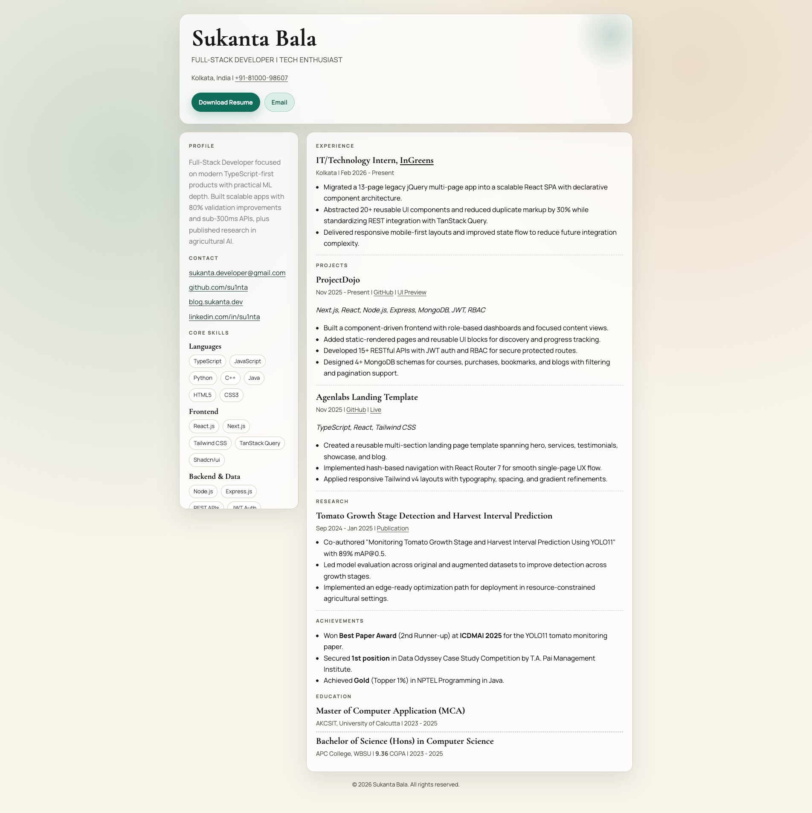

## Sukanta's Resume

A single-page resume website built with plain HTML and CSS.
The page uses a modern two-pane layout with responsive behavior, subtle motion, and print-friendly styling.

[Live Link](https://sukanta.dev)



### Features

- Single-page resume with clean visual hierarchy
- Responsive desktop and mobile layout
- Resume download button (Google Drive direct-download link)
- Organized sections for profile, experience, projects, research, achievements, and education
- Print styles for easy PDF/export usage

### Run locally

Open directly:

- Double-click `index.html`

Or run a local server (recommended):

**VS Code (Live Server extension)**

1. Install Live Server
2. Right-click `index.html` and choose Open with Live Server

**Python**

```bash
python3 -m http.server 5500
```

Then open `http://localhost:5500`.

### Customize

Edit `index.html` to update:

- Hero content (name, title, location, phone)
- Summary/profile text
- Experience, projects, and research details
- Skill chips and categories
- Contact links (email, GitHub, blog, LinkedIn)

#### Update the resume download link

The download button uses a Google Drive direct-download URL:

```html
href="https://drive.google.com/uc?export=download&id=YOUR_FILE_ID"
```

To use your own PDF:

1. Upload your resume PDF to Google Drive
2. Set sharing to Anyone with the link (if public access is needed)
3. Replace `YOUR_FILE_ID` with your file ID

### Deploy

This is a static site, so you can deploy it on:

- GitHub Pages
- Vercel
- Netlify

### Project structure

```text
.
├── CNAME
├── favicon.ico
├── html-resume-ss.png
├── index.html
└── README.md
```

### License

Free to use for personal resume/portfolio purposes.
If you fork or reuse it publicly, update the content with your own details.
